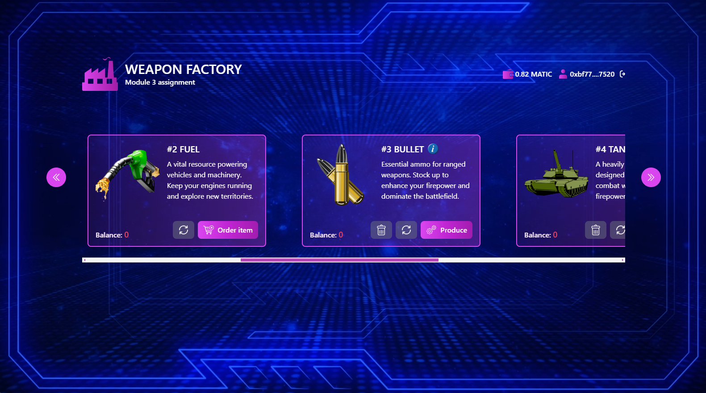
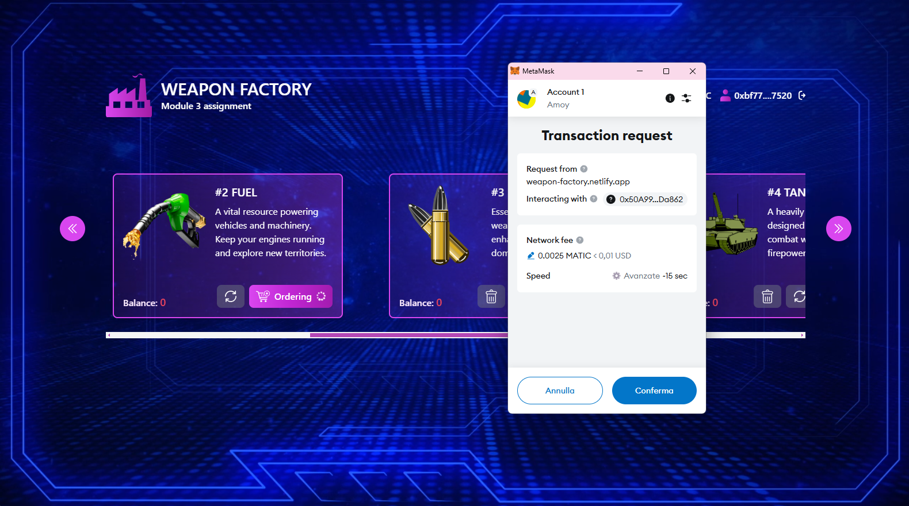
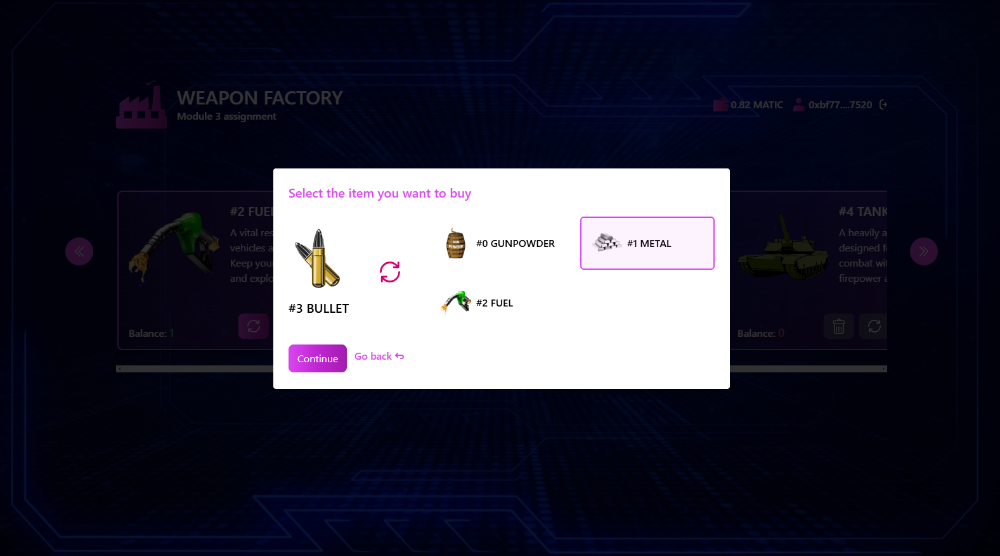
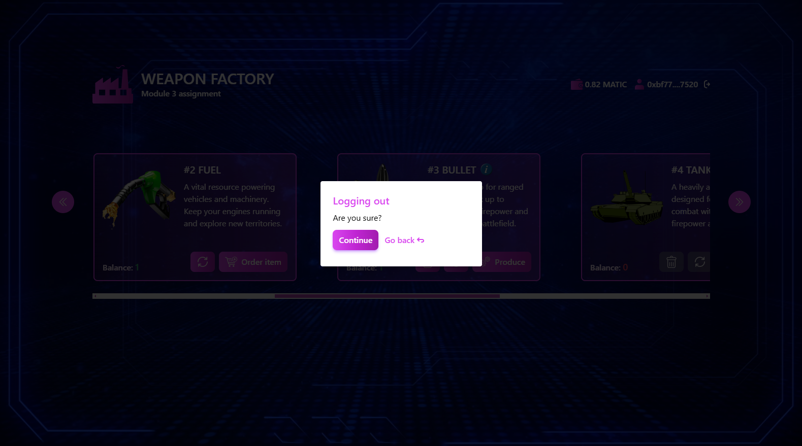

# Weapon Factory: ERC1155 Token Minting & Forging dApp

A decentralized web application that simulates a weapon factory, where users can mint and forge various military-grade assets as ERC1155 tokens. By combining raw materials like gunpowder, metal, and fuel, users can craft powerful items such as bullets, tanks, flares, and missiles. The dApp allows users to seamlessly connect using MetaMask to mint, forge and trade items. It also automatically prompts users to switch to the correct network upon connection. The smart contract is optimized for gas efficiency.

## 🌐 Smart Contract Source Code

- **View file on Github**: [View Solidity File](https://github.com/edobusti/web3-bootcamp-completed-projects/blob/main/module-3/WeaponFactory.sol)

## ⚙️ How It Works

### 🏭 **Minting (Raw Materials: GUNPOWDER, METAL, FUEL)**

- Users can mint **GUNPOWDER (0)**, **METAL (1)**, and **FUEL (2)**.
- Minting is free (gas fees apply) but has a **1-minute cooldown** per resource.
- Tradable only for other raw materials.

### 🔥 **Forging (Crafting Weapons & Vehicles)**

- By using specific raw materials, users can produce advanced assets:

  - **BULLET (3)** = Burn **GUNPOWDER + METAL**
  - **TANK (4)** = Burn **METAL + FUEL**
  - **FLARE (5)** = Burn **GUNPOWDER + FUEL**
  - **MISSILE (6)** = Burn **GUNPOWDER + METAL + FUEL**

- **These items are tradable for everything**

## Key Features

**Optimized Gas Efficiency** – Smart contract logic streamlined for lower costs.  
**Efficient Frontend State Management** – `useReducer` + Context API prevents prop drilling.
**IPFS Metadata Retrieval** – Images & attributes dynamically loaded.  
**Auto Network Detection** – Prompts users to switch to **Polygon Amoy Testnet** if needed.  
**Error Handling**: Error handling to manage issues.
**Modern UI** – Tailwind CSS for a better experience.

## 🔗 Tech Stack

- **Node.js**
- **Solidity**
- **ethers.js**
- **React**
- **Tailwind**
- **IPFS**

## 🌐 Live Version on Netlify

You can view the live version of the project on **Netlify**:

- **🔗 Live Demo URL**: [https://weapon-factory.netlify.app](https://weapon-factory.netlify.app)

## 🏁 Getting Started Locally

This app was bootstrapped using [Vite](https://vitejs.dev/).

### 📜 Run the dApp

In the project directory, you can run:

#### `npm run dev`

Runs the app in development mode. Open [http://localhost:5173](http://localhost:5173) to view it in your browser.

#### `npm run build`

Builds the app for production and outputs files to the `dist` folder.

#### `npm run preview`

Serves the built app locally for testing before deployment.

## 📚 Learn More

- [Vite Documentation](https://vitejs.dev/guide/)
- [React Documentation](https://react.dev/)

# 📸 Screenshots

## 🏭 1. Factory Overview

## 🦊 2. MetaMask Interaction

## 🔄 3. Trade Items

## 🚪 4. Log Out

